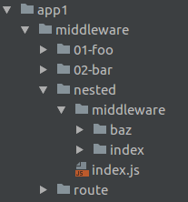

# koa-architect

[![NPM version][npm-image]][npm-url]
[![Build status][travis-image]][travis-url]
[![Test coverage][coveralls-image]][coveralls-url]


## About
Reads a folder with middleware and routes and reduces them to middleware using [koa-mount](https://github.com/koajs/mount) and [koa-trie-router](https://github.com/koajs/trie-router).  
That eventually allows you run your app extremely simple:

```js
const Koa = require('koa')
const architect = require('koa-architect')

let app = new Koa()

for(let middleware of architect.readMiddlewareAndRoutes('./middleware')) {
  app.use(middleware)
}
```
All of you need is keep in mind next things:
1. each your file should returns a middleware or routes
2. if it returns middleware then it will be pushed to the middleware stack
3. if it returns routes then they will be reduced to middleware using a router

### How does exactly your routes will be reduced to middleware?
```js
// router.use(fn)
exports.use = function (ctx) {
}

// router.get('/', fn)
exports.get = {
  'index': function (ctx) {
  }
}

// router.post('/foo', fn)
// router.post('/bar/:id', fn)
exports.post = {
  'foo': function (ctx) {
  },
  'bar/:id': function (ctx) {
  }
}
```

## Example
Assume, we have next folder tree and code:



```
middleware/
middleware/01-foo/index.js
middleware/02-bar/index.js
middleware/route/index.js
middleware/nested/index.js
middleware/nested/middleware/index/index.js
middleware/nested/middleware/baz/index.js
```
**middleware/01-foo/index.js**
```js
// Middleware
module.exports = function (ctx, next) {
  // Doing here some work and go next
  ctx.state.foo = 1
  return next()
}
```
**middleware/02-bar/index.js**
```js
// Middleware
module.exports = function (ctx, next) {
  // Doing here some work and go next
  ctx.state.bar = 1
  return next()
}
```
**middleware/route/index.js**
```js
// Routes
exports.get = {
  'index': function (ctx) {
    ctx.response.body = ctx.state
  }
}

exports.post = {
  'test/:id': function (ctx) {
    ctx.response.body = ctx.params.id
  }
}
```
**middleware/nested/index.js**
```js
// Nested middleware and/or routes

const path = require('path')
const architect = require('koa-architect')

// Since this folder contains nested middleware/routes
// we need use koa-architect to read them

exports.use = architect.readMiddlewareAndRoutes(path.join(__dirname, './middleware'))
```
**middleware/nested/middleware/index/index.js**
```js
// Routes
exports.use = function (ctx) {
  ctx.response.body = ctx.originalUrl
}
```
**middleware/nested/middleware/baz/index.js**
```js
// Routes
exports.get = {
  'index': function (ctx) {
    ctx.response.body = ctx.originalUrl
  }
}
```

And we launch our app using this way:
```js
const Koa = require('koa')
const architect = require('koa-architect')

let app = new Koa()

for(let middleware of architect.readMiddlewareAndRoutes('./middleware')) {
  app.use(middleware)
}
```

Thus we will get a server which handle requests next way:
```
GET --> / 
GET <-- 404 "Not Found"

GET --> /route
GET <-- 200 {"foo":1,"bar":1}

POST --> /route/test/1
POST <-- 200 "1"

GET --> /nested
GET <-- 200 "/nested"

GET --> /nested/baz
GET <-- 200 "/nested/baz"
```

See [test/fixtures](./test/fixtures) for details.


## Package managers
### NPM
```
npm install koa-architect
```
You could find this module in npm like [_koa-architect_](https://www.npmjs.com/search?q=koa-architect).


[npm-image]: https://img.shields.io/npm/v/koa-architect.svg?style=flat
[npm-url]: https://npmjs.org/package/koa-architect
[travis-image]: https://img.shields.io/travis/nervgh/koa-architect.svg?style=flat
[travis-url]: https://travis-ci.org/nervgh/koa-architect
[coveralls-image]: https://img.shields.io/coveralls/nervgh/koa-architect.svg?style=flat
[coveralls-url]: https://coveralls.io/r/nervgh/koa-architect?branch=master